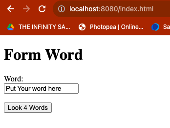
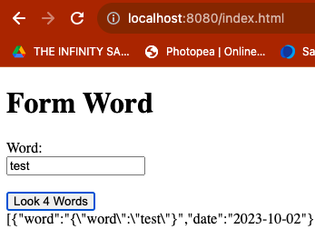
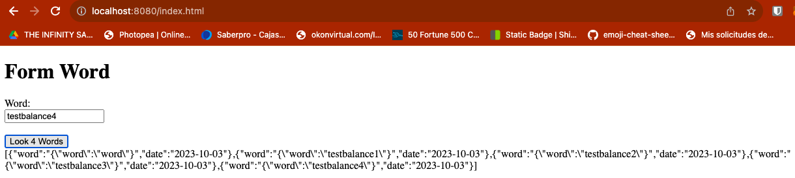

<h1 align="center">
<p align="center">Round Robin Load Balancer</p>
</h1>

## Introducción
Este proyecto pretende implementar un balanceador de cargas que implementa el algoritmo de
*Round Robin* junto con un cliente web y un servicio web en donde se tiene un campo y un
botón y cada vez que el usuario envía un mensaje, este se lo envía al servicio REST y
actualiza la pantalla con la información que este le regresa en formato JSON.

## Instalación
Para poder instalar y usar este proyecto, se necesitará:
* Git.
* Maven.
* Java.
* Intellij o alguna IDE.
* Docker (Para pruebas de uso local).
* Cuenta AWS (Para hacer uso de sus máquinas virtuales).

En la terminal de tu preferencia y en el directorio en donde trabajarás ejecuta la siguiente línea:

    git clone https://github.com/isaeme23/APP-LB-RoundRobin.git

Por medio de GitHub CLI se podrá instalar este proyecto con la siguiente línea:

    gh repo clone isaeme23/APP-LB-RoundRobin

## Uso del proyecto
### De forma Remota
Una vez instalado, podrás abrirlo en la IDE de su preferencia. Para compilar el código, en la terminal
del proyecto puedes escribir el siguiente comando:

    mvn clean package

Antes de ejecutar este proyecto, debemos ejecutar el servicio correspondiente al que redirigiremos las
peticiones del cliente web. El servicio correspondiente lo podremos encontrar en el siguiente repositorio
junto con sus instrucciones de uso:

```
- https://github.com/isaeme23/LogService
```

Una vez compilado y con el servicio corriendo, podrás ejecutar este proyecto con el siguiente comando en
la terminal correspondiente:

    mvn spring-boot:run

Al ejecutar el proyecto, podremos ver como funciona el proyecto colocando la siguiente línea en el navegador
nuestra preferencia.

    localhost:8080/index.html

Asi podremos ver la siguiente pantalla:



Si ingresamos cualquier palabra en espacio para insertar texto y hacemos click en el botón veremos el siguiente
comportamiento:



### APP Balancer y Log Service en remoto e Instancia de MongoDB en Docker

**Antes de iniciar, debes asegurarte de que tienes Docker instalado en tu maquina local.**

Una vez instalado, podrás abrirlo en la IDE de su preferencia. Para compilar el código, en la terminal
del proyecto puedes escribir el siguiente comando:

    mvn clean package

Para probar con la instancia de MongoDB es importante cambiar las configuraciones necesarias indicadas en
la documentación del proyecto de **LogService** para permitir la conexión.

Luego de esto, en nuestra terminal ejecutaremos el siguiente comando para instalar la instancia de mongodb
y asi mismo iniciarla.

    docker run -d -p 27017:27017 --name mongodb-instance mongo

Si todo sale en orden, en la aplicación de Docker Desktop podremos ver la instancia creada:


Luego, podremos probar nuestro proyecto ejecutando primero LogService con las instrucciones respectivas y
después podremos ejecutar este proyecto con la siguiente línea en nuestra terminal:

    mvn spring-boot:run

Al ejecutar el proyecto, podremos ver como funciona el proyecto colocando la siguiente línea en el navegador
nuestra preferencia.

    localhost:8080/index.html

Si insertamos distintas palabras y apretamos en el boton de enviar, podremos ver el funcionamiento del proyecto asi:



### En Maquina virtual EC2 de AWS

Para esto, subiremos ambos proyectos a DockerHuB, estos los podremos encontrar en:

    https://hub.docker.com/repository/docker/isaeme23/logservice
    https://hub.docker.com/repository/docker/isaeme23/applbroundrobin

Al correr junto con docker-compose ambos en una instancia de EC2 de AWS al haber instalado docker en esta
máquina, podremos ver el comportamiento en el siguiente video.

https://youtu.be/4GK5C12VU20

## Autores
Isabella Manrique

## Agradecimientos
Profe Luis Daniel Benavides Navarro